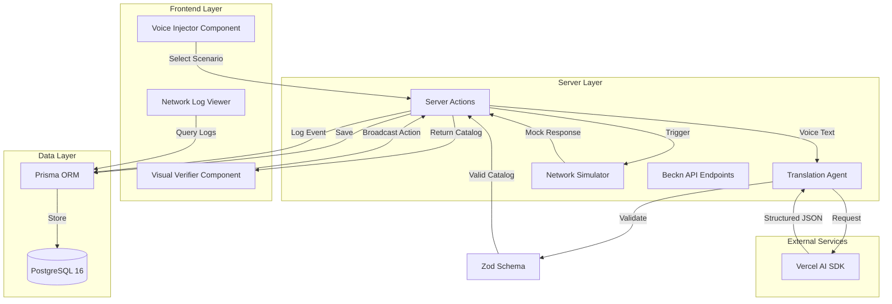
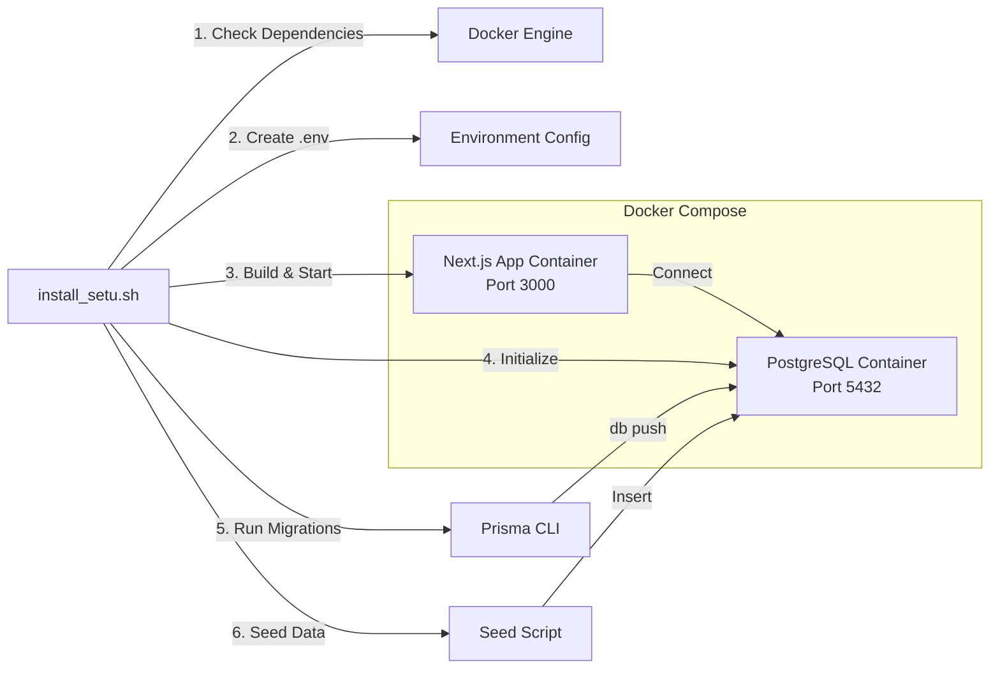

# Design Document: Setu - Voice-to-ONDC Gateway

## Overview

Setu is a Next.js 15 application that bridges the gap between illiterate farmers and the ONDC ecosystem by translating vernacular voice commands into Beckn Protocol-compliant JSON catalogs. The system consists of three primary modules: a Voice-to-Protocol Engine that simulates and translates voice input, a Visual Verifier that presents catalog data through an accessibility-first interface, and a Network Simulator that demonstrates buyer network interactions.

The application follows a modern TypeScript-first architecture using Next.js 15 App Router, Server Actions for data mutations, Prisma for database operations, and Vercel AI SDK for structured AI output. The entire system is containerized using Docker and can be deployed with a single shell script.

## Architecture

### High-Level Architecture



### Technology Stack

- **Frontend Framework:** Next.js 15 (App Router)
- **UI Library:** React 18+ with TypeScript
- **Styling:** Tailwind CSS 4.0
- **Component Library:** Shadcn/UI
- **Animation:** Framer Motion
- **Server Communication:** Next.js Server Actions
- **AI Integration:** Vercel AI SDK (Core) with streamObject/generateObject
- **Database:** PostgreSQL 16 (Alpine Docker Image)
- **ORM:** Prisma with TypeScript types
- **Validation:** Zod for schema validation
- **Containerization:** Docker & Docker Compose
- **Type Safety:** TypeScript strict mode

### Deployment Architecture



## Components and Interfaces

### 1. Voice Injector Component

**Purpose:** Simulates voice input through a dropdown interface with pre-configured scenarios.

**Location:** `components/VoiceInjector.tsx`

**Props:**
```typescript
interface VoiceInjectorProps {
  onScenarioSelect: (text: string) => Promise<void>;
  isProcessing: boolean;
}
```

**State:**
```typescript
interface VoiceInjectorState {
  selectedScenario: string | null;
  scenarios: VoiceScenario[];
}

interface VoiceScenario {
  id: string;
  label: string;
  text: string;
  icon: string;
}
```

**Behavior:**
- Renders a dropdown with pre-configured voice scenarios
- Displays scenario labels with icons for visual identification
- Triggers translation when a scenario is selected
- Shows loading state during processing
- Disables selection while processing

**UI Requirements:**
- Large touch targets (minimum 44x44px)
- High contrast colors
- Icon-based scenario identification
- Smooth dropdown animation using Framer Motion

### 2. Translation Agent

**Purpose:** Converts vernacular voice text into Beckn Protocol-compliant JSON using AI.

**Location:** `lib/translation-agent.ts`

**Interface:**
```typescript
interface TranslationAgent {
  translate(voiceText: string): Promise<BecknCatalogItem>;
  translateWithFallback(voiceText: string): Promise<BecknCatalogItem>;
}

interface BecknCatalogItem {
  descriptor: {
    name: string;
    symbol: string; // URL to image
  };
  price: {
    value: number;
    currency: string;
  };
  quantity: {
    available: {
      count: number;
    };
    unit: string;
  };
  tags: {
    grade?: string;
    perishability?: string;
    logistics_provider?: string;
  };
}
```

**Implementation Strategy:**

1. **AI-Powered Translation:**
   - Use Vercel AI SDK's `generateObject` function
   - Define Zod schema for BecknCatalogItem
   - Extract product name, quantity, quality, location from voice text
   - Map vernacular terms to standardized Beckn categories
   - Generate appropriate logistics provider based on product type

2. **Fallback Mechanism:**
   - Check for AI API key availability
   - Implement retry logic (3 attempts with exponential backoff)
   - If all attempts fail, return hardcoded success response
   - Hardcoded response should be a valid onion catalog item

3. **Validation:**
   - Validate AI output against Zod schema
   - Ensure all required fields are present
   - Apply defaults for missing optional fields
   - Log validation errors for debugging

**Example Translation Flow:**
```
Input: "Arre bhai, 500 kilo pyaaz hai Nasik se, Grade A hai, aaj hi uthana hai"

AI Extraction:
- Product: Onions (pyaaz)
- Quantity: 500 kg
- Origin: Nasik
- Grade: A
- Urgency: Today (aaj hi)

Output JSON:
{
  descriptor: {
    name: "Nasik Onions",
    symbol: "/icons/onion.png"
  },
  price: {
    value: 40,
    currency: "INR"
  },
  quantity: {
    available: { count: 500 },
    unit: "kg"
  },
  tags: {
    grade: "A",
    perishability: "medium",
    logistics_provider: "India Post"
  }
}
```

### 3. Visual Verifier Component

**Purpose:** Displays catalog data as an accessible visual card with minimal text.

**Location:** `components/VisualVerifier.tsx`

**Props:**
```typescript
interface VisualVerifierProps {
  catalog: BecknCatalogItem;
  onBroadcast: () => Promise<void>;
  isBroadcasting: boolean;
}
```

**UI Structure:**
```
┌─────────────────────────────────────┐
│  [Large Commodity Icon - 128x128]   │
│                                     │
│  ┌─────────────────────────────┐   │
│  │  ₹40 per kg                 │   │  <- Price Badge
│  └─────────────────────────────┘   │
│                                     │
│  [Logistics Logo - 64x64]          │
│                                     │
│  ┌─────────────────────────────┐   │
│  │                             │   │
│  │    [Thumbprint Icon]        │   │  <- Broadcast Button
│  │    120x120px                │   │     (Large, High Contrast)
│  │                             │   │
│  └─────────────────────────────┘   │
└─────────────────────────────────────┘
```

**Visual Elements:**
- **Commodity Icon:** Large (128x128px), colorful icon representing the product
- **Price Badge:** High-contrast badge with large font (32px) showing price
- **Quantity Indicator:** Visual representation (e.g., bag icons) with number
- **Logistics Logo:** Recognizable logo of logistics provider (64x64px)
- **Thumbprint Button:** Large (120x120px) button with thumbprint icon and animation

**Animations:**
- Card entrance: Slide up with fade-in
- Button hover: Scale up slightly (1.05x)
- Button press: Scale down (0.95x) with haptic feedback
- Broadcast success: Confetti animation or checkmark pulse

**Accessibility Features:**
- Minimum contrast ratio: 4.5:1
- No text-only information (everything has visual representation)
- Large touch targets (minimum 44x44px)
- Clear visual hierarchy through size and color

### 4. Network Simulator

**Purpose:** Simulates buyer network responses to broadcasted catalogs.

**Location:** `lib/network-simulator.ts`

**Interface:**
```typescript
interface NetworkSimulator {
  simulateBroadcast(catalogId: string): Promise<BuyerBid>;
}

interface BuyerBid {
  buyerName: string;
  bidAmount: number;
  timestamp: Date;
  buyerLogo: string;
}
```

**Behavior:**
1. Wait 8 seconds after broadcast (simulating network latency)
2. Generate a mock buyer bid with realistic data
3. Select buyer name from pool: ["Reliance Fresh", "BigBasket", "Paytm Mall", "Flipkart Grocery"]
4. Calculate bid amount (catalog price ± 5-10%)
5. Log event to NetworkLog table
6. Return bid data for UI notification

**Implementation:**
```typescript
async function simulateBroadcast(catalogId: string): Promise<BuyerBid> {
  // Wait 8 seconds
  await new Promise(resolve => setTimeout(resolve, 8000));
  
  // Get catalog details
  const catalog = await prisma.catalog.findUnique({
    where: { id: catalogId }
  });
  
  // Generate mock bid
  const buyers = [
    { name: "Reliance Fresh", logo: "/logos/reliance.png" },
    { name: "BigBasket", logo: "/logos/bigbasket.png" },
    { name: "Paytm Mall", logo: "/logos/paytm.png" },
    { name: "Flipkart Grocery", logo: "/logos/flipkart.png" }
  ];
  
  const selectedBuyer = buyers[Math.floor(Math.random() * buyers.length)];
  const catalogPrice = catalog.beckn_json.price.value;
  const bidAmount = catalogPrice * (0.95 + Math.random() * 0.1);
  
  // Log to database
  await prisma.networkLog.create({
    data: {
      type: "INCOMING_BID",
      payload: {
        buyerName: selectedBuyer.name,
        bidAmount,
        catalogId
      },
      timestamp: new Date()
    }
  });
  
  return {
    buyerName: selectedBuyer.name,
    bidAmount,
    timestamp: new Date(),
    buyerLogo: selectedBuyer.logo
  };
}
```

### 5. Network Log Viewer Component

**Purpose:** Displays raw JSON traffic for debugging and transparency.

**Location:** `components/NetworkLogViewer.tsx`

**Props:**
```typescript
interface NetworkLogViewerProps {
  farmerId?: string;
  limit?: number;
}
```

**State:**
```typescript
interface NetworkLogViewerState {
  logs: NetworkLog[];
  filter: "ALL" | "OUTGOING_CATALOG" | "INCOMING_BID";
  expandedLogId: string | null;
  currentPage: number;
}
```

**UI Features:**
- Chronological list of network events
- Color-coded event types (green for outgoing, blue for incoming)
- Expandable log entries showing formatted JSON
- Syntax highlighting for JSON payloads
- Filter dropdown for event types
- Pagination controls (10 logs per page)

### 6. Server Actions

**Purpose:** Handle server-side data mutations and business logic.

**Location:** `app/actions.ts`

**Actions:**

```typescript
// Translate voice text to Beckn catalog
async function translateVoiceAction(voiceText: string): Promise<{
  success: boolean;
  catalog?: BecknCatalogItem;
  error?: string;
}>;

// Save catalog to database
async function saveCatalogAction(
  farmerId: string,
  catalog: BecknCatalogItem
): Promise<{
  success: boolean;
  catalogId?: string;
  error?: string;
}>;

// Broadcast catalog and trigger network simulation
async function broadcastCatalogAction(catalogId: string): Promise<{
  success: boolean;
  bid?: BuyerBid;
  error?: string;
}>;

// Fetch network logs
async function getNetworkLogsAction(
  filter?: string,
  page?: number
): Promise<{
  logs: NetworkLog[];
  totalPages: number;
}>;
```

**Error Handling:**
- All actions return typed result objects with success flag
- Errors are logged to console and returned to client
- Client displays user-friendly error messages
- Critical errors trigger fallback mechanisms

## Data Models

### Prisma Schema

**Location:** `prisma/schema.prisma`

```prisma
generator client {
  provider = "prisma-client-js"
}

datasource db {
  provider = "postgresql"
  url      = env("DATABASE_URL")
}

model Farmer {
  id              String    @id @default(cuid())
  name            String
  locationLatLong String?   // Format: "lat,long"
  languagePref    String    @default("hi") // ISO 639-1 code
  upiId           String?
  createdAt       DateTime  @default(now())
  updatedAt       DateTime  @updatedAt
  
  catalogs        Catalog[]
  
  @@map("farmers")
}

model Catalog {
  id          String   @id @default(cuid())
  farmerId    String
  becknJson   Json     // Stores BecknCatalogItem
  status      CatalogStatus @default(DRAFT)
  createdAt   DateTime @default(now())
  updatedAt   DateTime @updatedAt
  
  farmer      Farmer   @relation(fields: [farmerId], references: [id], onDelete: Cascade)
  
  @@index([farmerId])
  @@index([status])
  @@map("catalogs")
}

enum CatalogStatus {
  DRAFT
  BROADCASTED
  SOLD
}

model NetworkLog {
  id        String   @id @default(cuid())
  type      NetworkLogType
  payload   Json
  timestamp DateTime @default(now())
  
  @@index([type])
  @@index([timestamp])
  @@map("network_logs")
}

enum NetworkLogType {
  OUTGOING_CATALOG
  INCOMING_BID
}
```

### Zod Schemas

**Location:** `lib/beckn-schema.ts`

```typescript
import { z } from "zod";

export const BecknDescriptorSchema = z.object({
  name: z.string().min(1, "Product name is required"),
  symbol: z.string().url("Symbol must be a valid URL")
});

export const BecknPriceSchema = z.object({
  value: z.number().positive("Price must be positive"),
  currency: z.string().length(3, "Currency must be 3-letter code").default("INR")
});

export const BecknQuantitySchema = z.object({
  available: z.object({
    count: z.number().positive("Count must be positive")
  }),
  unit: z.string().min(1, "Unit is required")
});

export const BecknTagsSchema = z.object({
  grade: z.string().optional(),
  perishability: z.enum(["low", "medium", "high"]).optional(),
  logistics_provider: z.string().optional()
});

export const BecknCatalogItemSchema = z.object({
  descriptor: BecknDescriptorSchema,
  price: BecknPriceSchema,
  quantity: BecknQuantitySchema,
  tags: BecknTagsSchema
});

export type BecknCatalogItem = z.infer<typeof BecknCatalogItemSchema>;
```

### Type Exports

```typescript
// Export Prisma types
export type { Farmer, Catalog, NetworkLog, CatalogStatus, NetworkLogType } from "@prisma/client";

// Export Zod-inferred types
export type { BecknCatalogItem } from "./beckn-schema";
```

## Error Handling

### Error Categories

1. **AI Translation Errors**
   - API key missing or invalid
   - Rate limit exceeded
   - Timeout errors
   - Invalid response format

2. **Database Errors**
   - Connection failures
   - Constraint violations
   - Transaction failures

3. **Validation Errors**
   - Invalid Beckn Protocol structure
   - Missing required fields
   - Type mismatches

4. **Network Errors**
   - Simulation failures
   - Logging failures

### Error Handling Strategy

**AI Translation Errors:**
```typescript
async function translateWithFallback(voiceText: string): Promise<BecknCatalogItem> {
  // Check for API key
  if (!process.env.OPENAI_API_KEY) {
    console.warn("AI API key missing, using fallback response");
    return FALLBACK_CATALOG;
  }
  
  // Retry logic with exponential backoff
  for (let attempt = 1; attempt <= 3; attempt++) {
    try {
      const result = await generateObject({
        model: openai("gpt-4"),
        schema: BecknCatalogItemSchema,
        prompt: buildPrompt(voiceText)
      });
      
      return result.object;
    } catch (error) {
      console.error(`Translation attempt ${attempt} failed:`, error);
      
      if (attempt === 3) {
        console.warn("All translation attempts failed, using fallback");
        return FALLBACK_CATALOG;
      }
      
      // Exponential backoff
      await new Promise(resolve => setTimeout(resolve, 1000 * Math.pow(2, attempt)));
    }
  }
  
  return FALLBACK_CATALOG;
}

const FALLBACK_CATALOG: BecknCatalogItem = {
  descriptor: {
    name: "Nasik Onions",
    symbol: "/icons/onion.png"
  },
  price: {
    value: 40,
    currency: "INR"
  },
  quantity: {
    available: { count: 500 },
    unit: "kg"
  },
  tags: {
    grade: "A",
    perishability: "medium",
    logistics_provider: "India Post"
  }
};
```

**Database Errors:**
```typescript
async function saveCatalogAction(
  farmerId: string,
  catalog: BecknCatalogItem
): Promise<{ success: boolean; catalogId?: string; error?: string }> {
  try {
    const result = await prisma.catalog.create({
      data: {
        farmerId,
        becknJson: catalog,
        status: "DRAFT"
      }
    });
    
    return { success: true, catalogId: result.id };
  } catch (error) {
    console.error("Database error:", error);
    
    if (error.code === "P2003") {
      return { success: false, error: "Farmer not found" };
    }
    
    return { success: false, error: "Failed to save catalog" };
  }
}
```

**Validation Errors:**
```typescript
function validateCatalog(data: unknown): BecknCatalogItem {
  try {
    return BecknCatalogItemSchema.parse(data);
  } catch (error) {
    if (error instanceof z.ZodError) {
      console.error("Validation errors:", error.errors);
      throw new Error(`Invalid catalog: ${error.errors.map(e => e.message).join(", ")}`);
    }
    throw error;
  }
}
```

**User-Facing Error Messages:**
- Display high-contrast error notifications
- Use simple, icon-based error indicators
- Avoid technical jargon
- Provide clear next steps (e.g., "Try again" button)

## Testing Strategy

The testing strategy for Setu follows a dual approach combining unit tests for specific examples and edge cases with property-based tests for universal correctness properties.

### Testing Framework Setup

- **Unit Testing:** Vitest with React Testing Library
- **Property-Based Testing:** fast-check library
- **E2E Testing:** Playwright (optional, for integration flows)
- **Test Configuration:** Minimum 100 iterations per property test

### Unit Testing Focus

Unit tests should focus on:
- Specific examples demonstrating correct behavior
- Edge cases (empty inputs, boundary values)
- Error conditions and fallback mechanisms
- Component rendering and user interactions
- Integration points between modules

### Property-Based Testing Focus

Property tests should focus on:
- Universal properties that hold for all inputs
- Data transformation correctness
- Round-trip properties (serialization/deserialization)
- Invariants that must be preserved
- Comprehensive input coverage through randomization

### Test Organization

```
tests/
├── unit/
│   ├── components/
│   │   ├── VoiceInjector.test.tsx
│   │   ├── VisualVerifier.test.tsx
│   │   └── NetworkLogViewer.test.tsx
│   ├── lib/
│   │   ├── translation-agent.test.ts
│   │   └── network-simulator.test.ts
│   └── actions/
│       └── actions.test.ts
├── property/
│   ├── beckn-schema.property.test.ts
│   ├── translation.property.test.ts
│   └── catalog-operations.property.test.ts
└── e2e/
    └── full-flow.spec.ts
```

### Test Tagging Convention

Each property-based test must include a comment tag referencing the design document property:

```typescript
// Feature: setu-voice-ondc-gateway, Property 1: Beckn schema validation round-trip
test("Beckn catalog serialization preserves structure", () => {
  fc.assert(
    fc.property(becknCatalogArbitrary, (catalog) => {
      const serialized = JSON.stringify(catalog);
      const deserialized = JSON.parse(serialized);
      expect(deserialized).toEqual(catalog);
    }),
    { numRuns: 100 }
  );
});
```

### Key Testing Areas

1. **Translation Agent:**
   - Unit: Test fallback mechanism with missing API key
   - Unit: Test specific Hinglish phrases
   - Property: Verify all translations produce valid Beckn JSON

2. **Beckn Schema Validation:**
   - Unit: Test edge cases (zero prices, empty strings)
   - Property: Round-trip serialization/deserialization

3. **Visual Verifier:**
   - Unit: Test rendering with various catalog data
   - Unit: Test broadcast button interactions
   - Property: Verify all catalogs render without errors

4. **Network Simulator:**
   - Unit: Test 8-second delay
   - Unit: Test buyer selection randomness
   - Property: Verify all bids are within valid price range

5. **Database Operations:**
   - Unit: Test CRUD operations
   - Unit: Test constraint violations
   - Property: Verify referential integrity

### Continuous Integration

- Run all tests on every commit
- Fail build if any test fails
- Generate coverage reports
- Minimum 80% code coverage target

