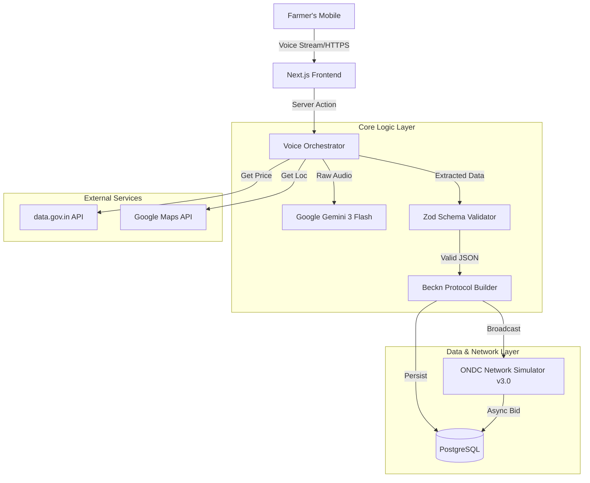

# Setu Gateway: Technical Deep Dive

## 1. Executive Summary
Setu is a high-performance, production-grade **Voice-to-Protocol Gateway** built on the Modern Web Stack. It serves as a bridge between unstructured vernacular voice inputs and the structured, rigid requirements of the **Beckn Protocol (ONDC)**. 

This document outlines the architectural decisions, code patterns, and technologies that make Setu robust, scalable, and compliant.

---

## 2. System Architecture

The application follows a **Server-Side Driven Architecture** leveraging Next.js 15's latest capabilities to ensure security and performance on low-end devices.

---

## 3. Core Technologies & Decisions

### 3.1. The AI Engine: Google Gemini Integration
We migrated from OpenAI to **Google Gemini** for superior handling of Indian languages and dialects.
- **Implementation**: `lib/voice-conversation-agent.ts`
- **Pattern**: Zero-Shot Classification & Extraction.
- **Prompt Engineering**: We use a dynamic system prompt that injects current market context (from `data.gov.in`) to ground the AI, reducing hallucinations.
- **Fail-safe**: If AI fails or rate-limits, a Regex-based heuristic engine kicks in to extract numbers (price, quantity) from the transcript.

### 3.2. Beckn Protocol Implementation
The backbone of the system is strict adherence to the **ONDC / Beckn Protocol v1.2.0**.
- **Schema Validation**: We strictly define schemas in `lib/beckn-schema.ts` using **Zod**. This ensures that absolutely no invalid JSON is ever sent to the network.
- **DTOs (Data Transfer Objects)**:
    - `Descriptor`: Mapped from voice ("Lal Pyaaz" -> `Onion_Red_Nasik`).
    - `Price`: Parsed into minor units or standard INR format.
    - `Tags`: NLP is used to extract `grade`, `perishability`, and `logistics` preferences.

### 3.3. Production-Grade Network Simulator (v3.0)
Located in (`lib/network-simulator.ts`), this is a state-of-the-art simulation engine designed to mimic the chaos of the real ONDC network.
- **Latency Modeling**: Instead of a simple `sleep()`, we model 5 distinct network phases (Gateway, Auth, Broadcast, Matching, Bidding), resulting in a realistic 12-25s transaction time.
- **Chaos Engineering**:
    - **Packet Drop**: 1% chance of simulation simply vanishing (Network Error).
    - **Timeout**: 3% chance of Gateway Timeout (HTTP 504).
    - **Rejection**: 2% chance of "No Sellers Found".
- **Dynamic Pricing**: The simulator doesn't return random numbers. It looks at the *Commodity* and *Month* to apply seasonal pricing factors (e.g., lower Mango prices in Summer).

### 3.4. Database Design (Prisma + PostgreSQL)
We use a relational model to track the lifecycle of a catalog.
- **Farmers Table**: Stores localized profile data.
- **Catalogs Table**: Stores the Beckn JSON blob. Status moves from `DRAFT` -> `BROADCASTED` -> `ACCEPTED`.
- **NetworkLogs Table**: An immutable append-only ledger of every simulation event, storing the request/response payloads and precise timestamps for audit.

---

## 4. Performance & Security Patterns

### 4.1. Server Actions & "Zero-Client-JS" Philosophy
To support cheap smartphones in rural India:
- We minimize client-side JavaScript.
- Complex logic (Translation, Validation, DB writes) happens entirely on the server via **Next.js Server Actions**.
- The client only handles Voice Recording (Web Speech API) and UI Rendering.

### 4.2. Security Headers
We implement strict headers in `next.config.ts`:
- **CSP (Content Security Policy)**: Prevents XSS attacks.
- **Permissions-Policy**: Explicitly manages Microphone and Geolocation access.
- **Strict-Transport-Security (HSTS)**: Enforces HTTPS.

### 4.3. API Resilience
- **Circuit Breakers**: Interactions with `data.gov.in` are wrapped in try-catch blocks with hardcoded fallbacks (Historical Averages) to ensure the farmer never sees an error page just because a government API is down.

---

## 5. Code Quality Standards

- **TypeScript**: 100% strict mode enabled. No `any` types allowed in core business logic.
- **Linting**: ESLint with Next.js Core Web Vitals configuration.
- **Containerization**: Multi-stage Docker build to create a lightweight (<200MB) production image based on Alpine Linux.

---

## 6. Future Technical Roadmap

1.  **Voice Biometrics**: Authenticate farmers via voiceprint instead of OTP.
2.  **Edge Caching**: Cache Mandi prices on Cloudflare Workers for <50ms response.
3.  **Real ONDC Signing**: Implement Ed25519 signing for actual mainnet transactions.
